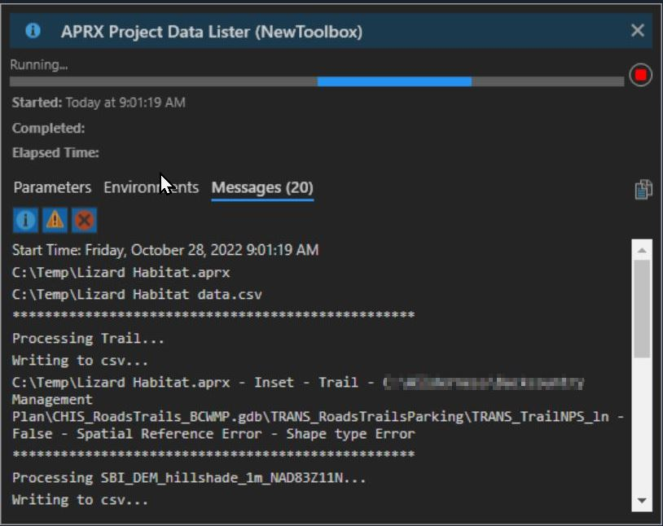

# pro-tools
Custom Python tools for esri ArcGIS Pro software. *Note: This repo was recently refactored to a python toolbox. Please report any bugs.*

## Contents

- [Backup AGOL Services](#backup-agol-services)
- [APRX Data Lister](#aprx-data-lister)
- [Export Metadata or GeoPackage](#export-metadata-or-geopackage)
- [Strip Geoprocessing Metadata](#strip-geoprocessing-metadata)
- [Zip Featureclasses for AppStream](#zip-featureclasses-for-appstream)
- [Print Bounding Box](#print-bounding-box)
- [Rename FC to be SDE Compliant](#rename-fc)

## Backup AGOL Services

### Purpose
Package an ArcGIS Online or Portal feature service as a zipped file geodatabase with a time stamp and username in the filename. It can also export as a shp or geojson file. The file is temporarily staged on the user's AGOL contents but is removed once downloaded. 

### To Use
Enter one more Item ID's into the input parameters of the toolbox. The URL of your service in AGOL will look something like this  
https://nps.maps.arcgis.com/home/item.html?id=b115ada92f0c4b7cb91ee166a6165ca2

Use the item ID (b115ada92f0c4b7cb91ee166a6165ca2) of the feature service as input. Each service entered will have its own zip file generated in the output folder.  

You must be signed into AGOL (or Portal) through Pro to have access to the Item IDs entered into the tool. 

If you regularly enter the same item IDs and output folder, you can enter them as defaults.  To do that, right click on the tool in the Catalog Pane in Pro and go to the tool Properties. Under the Parameters section, enter item IDs separated by a semicolon with no spaces in between. Paste in the catalog path into the Output Folder default.  

Example default parameters: 

Example tool output messages: 

Example tool file output: 

## APRX Data Lister

### Purpose
Walk all maps in an ArcGIS Pro .aprx file and export to csv the layer names, layer data sources, projection, and other useful info about all layers in all maps. Since the exact file path of layers in ArcGIS Pro project is not always apparent or easy to view in the context of the entire map frame, this tool is useful for inspecting an .aprx file with a wide range of data sources.

### To Use
Open tool in ArcGIS Pro. Drag and drop aprx from windows file explorer.  Output needs full path plus ".csv" extension.  

Example screenshot of input parameters:  

Example screenshot of tool running with output messages: 

Example csv output. This allows for inspection of broken links or where layers point to data on disk: 

## Export Metadata or GeoPackage

### Purpose
Exports one or more featureclasses or shapefiles as a ISO19115-3 or FGDC CSDGM metadata, and optional [GeoPackage](https://www.esri.com/arcgis-blog/products/product/data-management/how-to-use-ogc-geopackages-in-arcgis-pro/) file format using the alias of the input featureclass or shapefile. If no alias is available it will use the featureclass name. Also an option for stripping the whitespace from the filename upon output. Optionally exports an html version of FGDC metadata (if chosen) as an html file using the [USGS mp.exe](https://geology.usgs.gov/tools/metadata/tools/doc/mp.html) tool. 

### To Use
Open tool in ArcGIS Pro. Drag and drop features from catalog window. Accepts multiple files. Toggle export metadata option if needed.

## Strip Geoprocessing Metadata

### Purpose
Esri defaults to keeping geoprocessing metadata with the file even when exported, which may have sensitive data like file paths and other geoprocessing items. This tool strips geoprocessing metadata from one or more featureclass or shapefiles. Removes GPHISTORY as described in the deleteContent section of the [online reference](https://pro.arcgis.com/en/pro-app/latest/arcpy/metadata/metadata-class.htm). Optionally deletes THUMBNAIL, and ENCLOSED_FILES.

### To Use
Open tool in ArcGIS Pro. Drag and drop features from catalog window. Accepts multiple files. Toggle thumbnail and enclosed files options if needed.  

Example GP Strip tool interface: 

Example GP Strip tool output: 

## Zip Featureclasses for AppStream
### Purpose
Zip one or more featureclasses into a time-stamped zip file that contains a geodatabase.  Makes it easy to package up data for transfer to AppStream, since that can only be typically done through the web interface.

### To Use
Open tool in ArcGIS Pro. Drag and drop features from catalog window. Accepts multiple files. Specify an output folder.  Output folder will look something like  `AppStream_Staging_2023_08_14_17_28_53.gdb.zip` 

## Print Bounding Box

### Purpose
Print the bounding box of a featureclass in WGS84 lat long decimal coordinates for entering into metadata.

### To Use
Enter one more featureclasses into the input field (drag and drop compatible).  Set the decimal places, if desired.  

## Rename FC to be SDE Compliant
### Purpose
*Overwrites* a featureclass name to be compliant with the BOEM Pac naming scheme. Optionally and by default appends the feature type code and well known ID to the end of the file name.

### To Use
Open tool in ArcGIS Pro. Drag and drop features from catalog window. Apply appropriate dataset code and name.  Optionally append feature type code and well known ID. Example output name: `BIO_eBirdDatasetCamelCase_PT_4326`
> - Note: Tool currently only works on vector data.  Future to do: add ability for raster datasets. 
